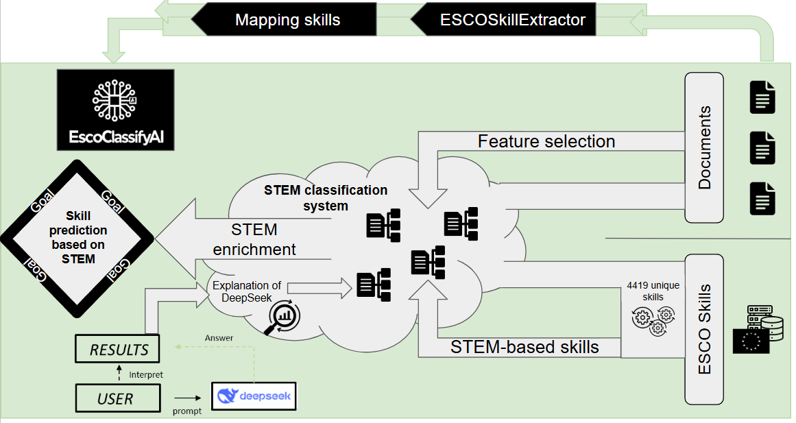
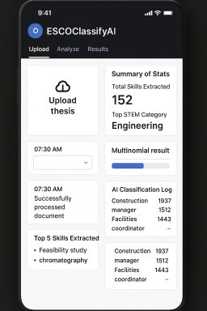

# ESCOclassifyAI 🧠📊

**ESCOclassifyAI** is an AI-driven skill classification framework that maps ESCO (European Skills, Competences, Qualifications and Occupations) skills to the core STEM domains—**Engineering**, **Science**, **Technology**, and **Mathematics**. It integrates classification algorithms, STEM enrichment, and explainability to support educational, labor market, and research analysis.



---

## 🚀 Key Features

- 🎯 **STEM-Based Skill Prediction**: Assigns ESCO skills to STEM categories with probability scores.
- 🧠 **AI & NLP Integration**: Combines classification techniques (e.g., LDA, LDA, vector models) with interpretability.
- 🧾 **Document Skill Extraction**: Extracts and enriches skills from theses, academic documents, or job profiles.
- 📊 **Feature Selection & Evaluation**: Built-in tools for refining features and evaluating model performance.
- 🧬 **STEM Enrichment**: Enhances predictions with contextual data and interpretable AI (via DeepSeek).

---

## 🖥️ GUI Preview

A clean and responsive interface allows users to upload documents and view real-time classification results, extracted skills, and summaries.



### GUI Highlights:
- 📤 Upload academic or research documents.
- 📈 View total extracted skills and top STEM category.
- 🧩 Multinomial classification results.
- 🧾 AI classification log with relevant occupations.
- ⭐ Top extracted skills at a glance.

---

## 🗂️ Project Structure

```bash
ESCOclassifyAI/
│
├── mapping_files/                  # Skill-to-occupation and ESCO mapping
│   ├── ESCO_Mapping_csv.csv
│   └── ESCO_mapping_occupations.csv
│
├── src/
│   ├── data-analysis/              # Analysis, classification, and evaluation
│   │   ├── LinearDiscriminantAnalysis.py
│   │   ├── STEM_categorizer.py
│   │   └── classifier_evaluation.py
│   │
│   ├── data/                       # Data collection and database tools
│   │   ├── mongodb_uploader.py
│   │   └── theses_collector.py
│   │
│   ├── pre-processing/            # ESCO skill extraction and processing
│       ├── Skill-Occupation_extractor.py
│       └── esco-skill-extractor.py
│
├── architecture.png           # Architecture Diagram
├── README.md                      # Project documentation
└── requirements.txt               # Python dependencies

