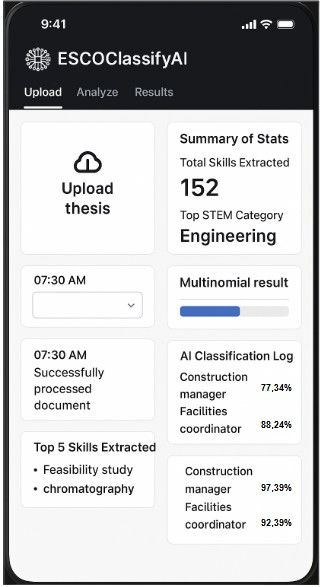

# ESCOclassifyAI 🧠📊

**ESCOclassifyAI** is an AI-driven skill classification framework that maps ESCO (European Skills, Competences, Qualifications and Occupations) skills to the core STEM domains—**Engineering**, **Science**, **Technology**, and **Mathematics**. It integrates classification algorithms, STEM enrichment, and explainability to support educational, labor market, and research analysis.


---

## 🚀 Key Features

- 📄 **Document Skill Extraction**: Automatically extract relevant skills from thesis or job documents.
- 🧠 **STEM Classification Engine**: Categorize skills into STEM domains using probabilistic models.
- 🤖 **AI Integration**: Built with interpretable AI (DeepSeek) to explain classification results.
- 📊 **Evaluation Tools**: Integrated modules for analyzing classification performance.
- 🖥️ **User Interface (GUI)**: Clean, mobile-friendly interface for easy interaction and real-time feedback.

## 📊 Technologies Used

- Python 3.x
- pandas, scikit-learn, numpy
- NetworkX, matplotlib
- HTML, JavaScript, React, Tailwind CSS (for GUI)
- MongoDB (for Database)

## 🚀 Getting Started

```bash
git clone https://github.com/yourusername/ESCOclassifyAI.git
cd ESCOclassifyAI
pip install -r requirements.txt
```

---

## 🖥️ GUI Preview

A clean and responsive interface allows users to upload documents and view real-time classification results, extracted skills, and summaries.



### GUI Highlights:
- 📤 Upload academic or research documents.
- 📈 View total extracted skills and top STEM category.
- 🧩 Multinomial classification results.
- 🧾 AI classification log with relevant occupations.
- ⭐ Top extracted skills at a glance.

---

## 📁 Directory Structure

```bash
ESCOclassifyAI/
│
├── app/                            # Frontend (React + Tailwind) for GUI
│   ├── public/                     # Static HTML files
│   │   ├── index.html
│   │   └── results-with-charts.html
│   │
│   ├── src/
│   │   ├── components/             # Reusable UI components
│   │   │   ├── ESCOClassifyAI.js
│   │   │   └── SkillChart.js
│   │   │
│   │   ├── utils/                  # Client-side logic
│   │   │   ├── skill-extraction.js
│   │   │   └── uploadHandler.js
│   │   │
│   │   ├── App.js
│   │   ├── index.js
│   │   └── index.css
│   │
│   ├── package.json                # Frontend dependencies
│   ├── tailwind.config.js          # Tailwind CSS config
│   └── postcss.config.js           # PostCSS config
│
├── datasets/                       # Final dataset used for classification
│   └── final_dataset.csv
│
├── images/                         # Visual assets for documentation
│   ├── architecture.png
│   └── gui_imageNew.png
│
├── mapping_files/                  # ESCO mapping CSVs
│   ├── ESCO_Mapping_csv.csv
│   └── ESCO_mapping_occupations.csv
│
├── src/
│   ├── data-analysis/              # Skill classification logic & evaluation
│   │   ├── LinearDiscriminantAnalysis.py
│   │   ├── STEM_categorizer.py
│   │   └── classifier_evaluation.py
│   │
│   ├── data/                       # MongoDB & document ingestion
│   │   ├── mongodb_uploader.py
│   │   └── theses_collector.py
│   │
│   └── pre-processing/             # Skill extraction from ESCO data
│       ├── Skill-Occupation_extractor.py
│       └── esco-skill-extractor.py
│
└── README.md                       # Project documentation
