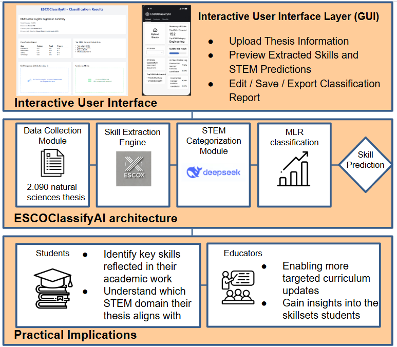

# ESCOclassifyAI 🧠📊

**ESCOclassifyAI** is an AI-driven skill classification framework that maps ESCO (European Skills, Competences, Qualifications and Occupations) skills to the core STEM domains—**Engineering**, **Science**, **Technology**, and **Mathematics**. It integrates classification algorithms, STEM enrichment, and explainability to support educational, labor market, and research analysis.



---

## 🚀 Key Features

- 📄 **Document Skill Extraction**: Automatically extract relevant skills from thesis or job documents.
- 🧠 **STEM Classification Engine**: Categorize skills into STEM domains using probabilistic models.
- 🤖 **AI Integration**: Built with interpretable AI (DeepSeek) to explain classification results.
- 📊 **Evaluation Tools**: Integrated modules for analyzing classification performance.
- 🖥️ **User Interface (GUI)**: Clean, mobile-friendly interface for easy interaction and real-time feedback.

## 📊 Technologies Used

- Python 3.x
- pandas, scikit-learn, numpy
- NetworkX, matplotlib
- React, Tailwind CSS (for GUI)
- MongoDB (for Database)

## 🚀 Getting Started

```bash
git clone https://github.com/yourusername/ESCOclassifyAI.git
cd ESCOclassifyAI
pip install -r requirements.txt
```

---

## 🖥️ GUI Preview

A clean and responsive interface allows users to upload documents and view real-time classification results, extracted skills, and summaries.


### GUI Highlights:
- 📤 Upload academic or research documents.
- 📈 View total extracted skills and top STEM category.
- 🧩 Multinomial classification results.
- 🧾 AI classification log with relevant occupations.
- ⭐ Top extracted skills at a glance.

---

## 📁 Directory Structure

```bash
ESCOclassifyAI/
│
├── datasets/                       # Finalized dataset used in classification
│   └── final_dataset.csv
│
├── images/                         # Visuals for architecture and GUI
│   ├── architecture.png
│   └── gui_image.png
│
├── mapping_files/                 # Mapping of ESCO skills and occupations
│   ├── ESCO_Mapping_csv.csv
│   └── ESCO_mapping_occupations.csv
│
├── src/
│   ├── data-analysis/              # Classification and evaluation logic
│   │   ├── LinearDiscriminantAnalysis.py
│   │   ├── STEM_categorizer.py
│   │   └── classifier_evaluation.py
│   │
│   ├── data/                       # Document ingestion and MongoDB upload
│   │   ├── mongodb_uploader.py
│   │   └── theses_collector.py
│   │
│   └── pre-processing/            # ESCO skill and occupation extraction
│       ├── Skill-Occupation_extractor.py
│       └── esco-skill-extractor.py
│
└── README.md                      # Project documentation

